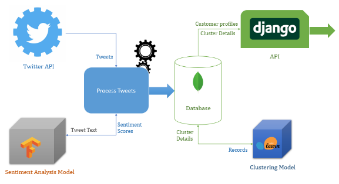
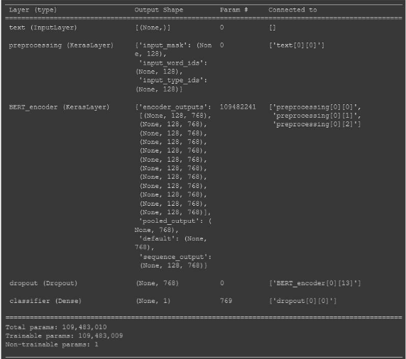
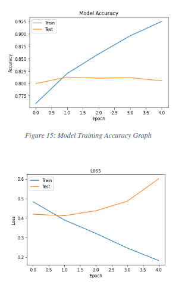
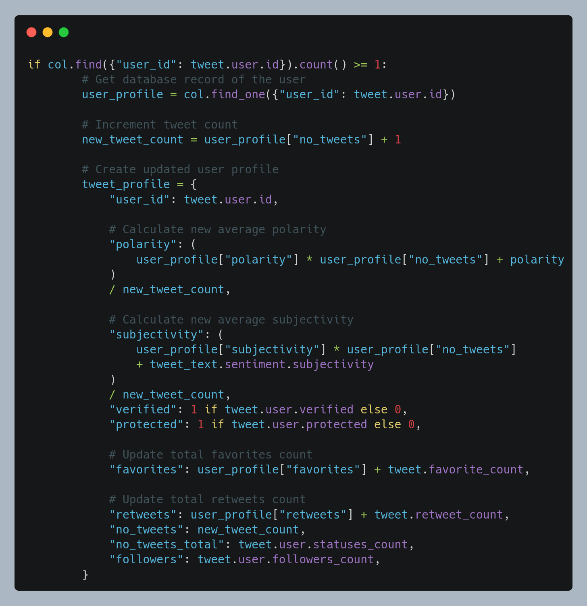
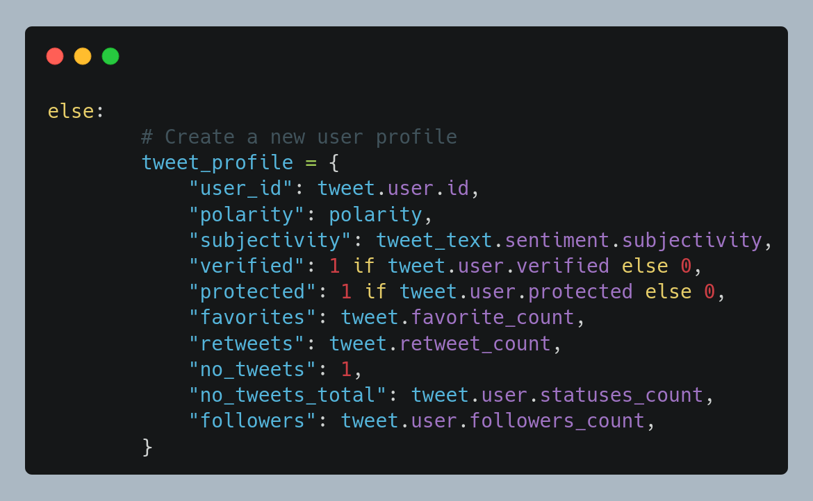
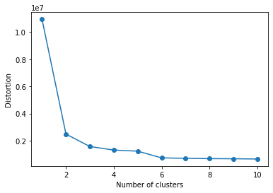

# Customer Profile Analysis using Twitter Analytics

## 1. Introduction

This project is designed to create an API that can be used by companies and brands to gather information about what people are posting about them on one of the most popular social media platforms, Twitter.

This approach to get information about customers to cluster them do not require usage of loyalty cards, surveys, or mobile applications(aside from Twitter, of course) as used in many customer profiling cases.

The program created in this repository is an attempt to profile customers of a certain company with the aid of deep learning(Natural Language Processing), clustering and Twitter API.

**All data retrieved from Twitter API will not violate privacy of any user. The program takes ONLY the information that can be used in profiling them. The information taken about the user will not in any way suffice to figure out the identity of a single user at any case.**  

## 2. Process Workflow

1. The system will retrieve Tweets mentioning the company Twitter handle or including a specific set of keywords.

2. Retrieved Tweets will be analyzed to determine the sentiment and subjectivity of the Tweet.

3. Determined sentiment analysis results, long with other few details about the author of the Tweet(again, no privacy violation) will be stored in a database to be used by the clustering program.

4. Clustering program will take information from the database and profile similar customers together and store clustering details in the database.

5. Details about clusters of customers can be accessed by the marketing team and can do direct, effective advertising to customers using Twitter API.

## 3. Components

This project is made up from a couple of components that provide services along the process workflow. Below is a high-level overview of the project's components and their interactions.

### 3.1. Twitter API

Twitter API was used to retrieve tweets that mention a specific set of keywords. A Twitter Developer account should be created to access the [Developer Platform](https://developer.twitter.com/en) and an App should be created in the platform to receive keys and tokens necessary to access Twitter API.

### 3.2. Sentiment Analysis Model

The sentiment analysis model is used to determine the sentiment behind a tweet. When a tweet is received using the Twitter API, its text is sent to the sentiment analysis model and it predicts the sentiment of the tweet either being positive, negative, or neutral. The model outputs a floating-point number in the range of 0-1, 0 being 100% negative and 1 being 100% positive. The model was created using TensorFlow and Keras.

#### 3.2.1. Preprocessing Text

[**bert_en_uncased_preprocess**](https://tfhub.dev/tensorflow/bert_en_uncased_preprocess/3) is a pipeline created to preprocess raw text into inputs that are accepted by BERT model, which was used as the architecture for sentiment analysis model.

#### 3.2.2. BERT Encoder

[**bert_en_uncased_L-12_H-768_A-12**](https://tfhub.dev/tensorflow/bert_en_uncased_L-12_H-768_A-12/4) is the BERT model used for the sentiment analysis model. The model expects input sequences that have a fixed length and are preprocessed and tokenized (which was done by the preprocessor). The model available on the TensorFlow Hub is pre-trained for English language using Wikipedia and BooksCorpus. Although it has been trained, all parameters of the model are trainable and it is recommended to fine-tune all the parameters. **The BERT Model was fine-tuned for this project**. More details on the training can be found on [Training subsection](#323-training) of this section.

Below is the complete model architecture.

#### 3.2.3. Training

Model was fine-tuned using [Sentiment140 Dataset](https://www.kaggle.com/kazanova/sentiment140). Below are some details involving the fine-tuning process.

| Parameter | Value |
| --------- | ----- |
| Train Set Size | 50000 |
| Test Set Size | 498 |
| No. of Epochs | 20 | 
| Batch Size | 32 |
| Validation Split | 0.2 |
| Optimizer | Adam |
| Learning Rate | 3e-5 |
| Loss Function | Binary Crossentropy |
| Accuracy Measure | Binary Accuracy |

Below are the accuracy and loss graphs of the training process.

### 3.3. Processing Tweets

When a tweet is retrieved from the Twitter API, a customer profile is created. Some details of the potential account profile (like number of tweets, follower count, verified, protected, etc.) are directly taken from tweet details whereas some (like polarity, subjectivity) are derived from details of the tweet. First, the system will check whether the database already contains the data of the account that posted the tweet by searching for the twitter user id.

- If the id is already in the database, the existing record will be updated.

- Else, a new record will be created in the database.

Finally, changes are written to the database.

### 3.4. Database

A local MongoDB was created to store customer profiles.

### 3.5. Clustering Model

Clustering model is used to group customers by the similarity of their profiles. Clustering customers and studying collective properties of each cluster gives a company a good insight about what kind of customer types they are dealing with and they can use that information to plan their marketing campaigns and promotions.

- Standard Scaling was used to preprocess the numerical columns of the dataset before using it to train the K-Means clustering model. 

- Elbow Method was used to find the optimum number of clusters that a dataset should be grouped into.

### 3.4. Django REST API

- The REST API to serve analytics data was created using Django REST Framework.

- The database was connected to the API using Pymongo package.

## Files

